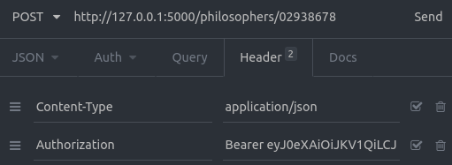

#### Python REST API with Flask, SQLite and JWT

1. Create virtual environment with Python 3.7

```
virtualenv -p python3.7 venv
```

2. Activate virtual environment

```
source venv/bin/activate
```

3. Install dependencies

```
pip install -r requirements.txt
```

4. Run the application

```
python app.py
```

##### A philosopher looks like this:

```json
{
    "id": 94839485,
    "name": "Jeremy Bentham",
    "reviews": 3.6
}
```

##### To create, read, update and delete a philosopher:

1. `POST` in `http://127.0.0.1:5000/signup` a chosen login and password

```json
{
	"login": "letmecheckthisproject",
	"password": "12345"
}
```

2. `POST` the user you created in `http://127.0.0.1:5000/login` and get the generated token

3. When performing CRUD, put the token in the header with "Bearer" right before it



Use a tool like Insomnia or Postman to hit the endpoints and test it.
